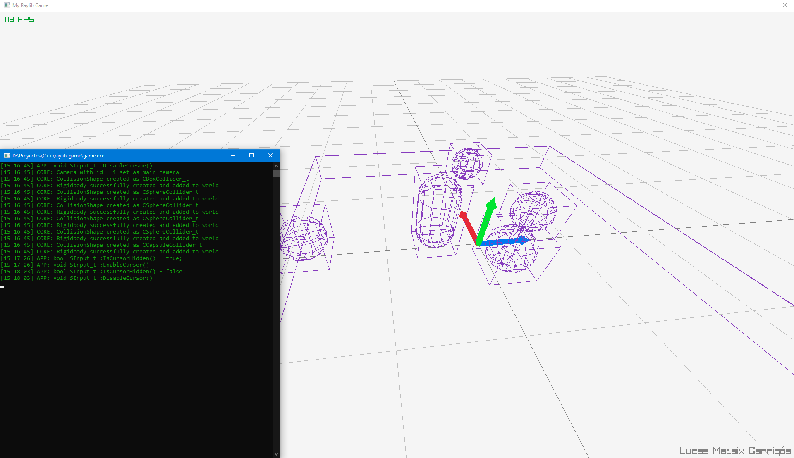

# raylib-game
Playground for Entt, Raylib and other technologies that might turn into a game.

- Integrated spdlog as a logging system that needs symbols from threads that could cause name collision (raylib's DrawText, DrawTextEx)
- Also, physics character controller working, right now is a movable kinematic rigidbody with axis rotation locked.

(Due to spdlog's requirement of thread-related headers and the lack of implementation in mingw, additional headers have been introduced which are already causing preprocessor name collusion, but  everything is set up so I can disable logs with a compiler flag)

## Past info
- Starting to look good, now that I have ImGui and Bullet integrated.